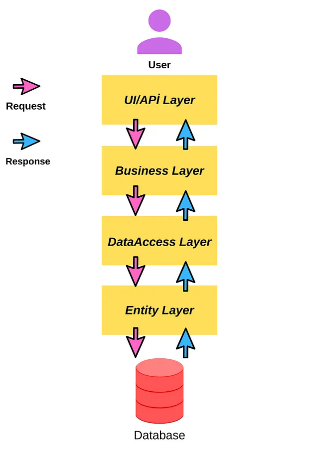

# EasyCashApp

- Geliştirme Ortamı: AspNet Core 8.0
- Dil: C#
- Framework: Entity Framework Core
- Mimari: N Tier Architecture (Çok Katmanlı Mimari)
- Design Pattern: Repository + CQRS + Unit Of Work
- Frontend: Html5 + Css3 + Bootstrap5
- Ana kurgu: Identity
- Veri Tabanı: MSSQL

DataAccessLayer.Abstract.IGenericDal
Butun tablolarda kullanilacak olan methodlarin tanimlandigi interface
DataAccessLayer.Abstract.ICustomerAccountDal
ise CustomerAccount'a özel methodlarin tanimlandigi interface

Response tipleri ?